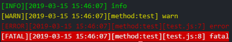

# node-petl
## 项目介绍
1. 描述
自定义的开发工具包

  2. 功能
  * 日志功能

## 如何使用
### log 工具使用
  1.引入工具包

  `let log = require ('node-petl');`

  2.使用

  ```
  log.debug('debug');
  log.info('info');
  log.warn('warn');
  log.error('error');
  log.fatal('fatal');

  ```

  3.效果
  
  


  4.配置文件
